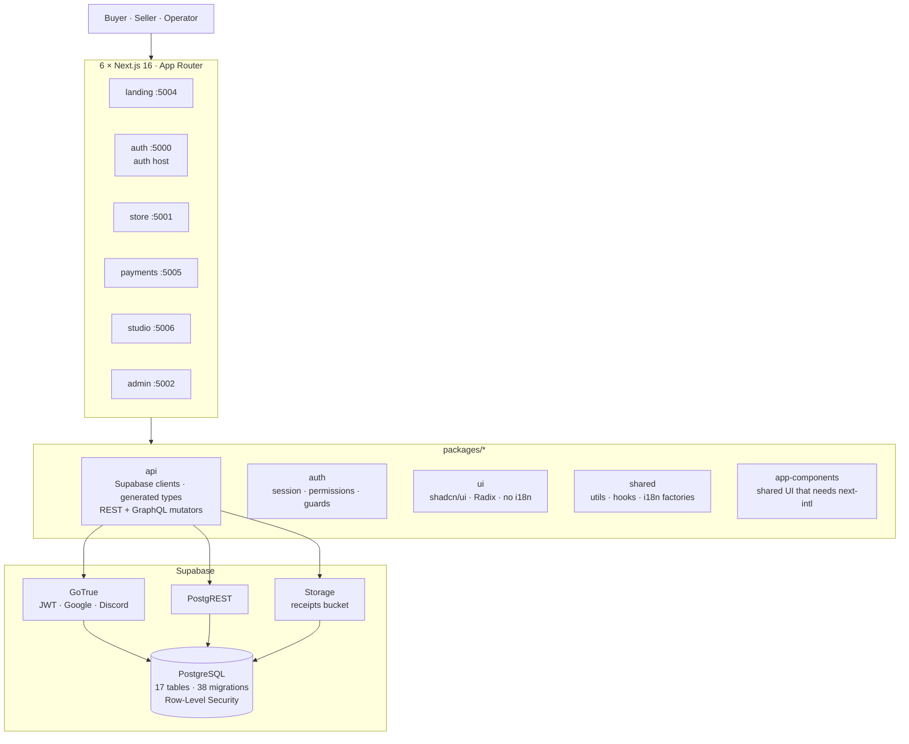
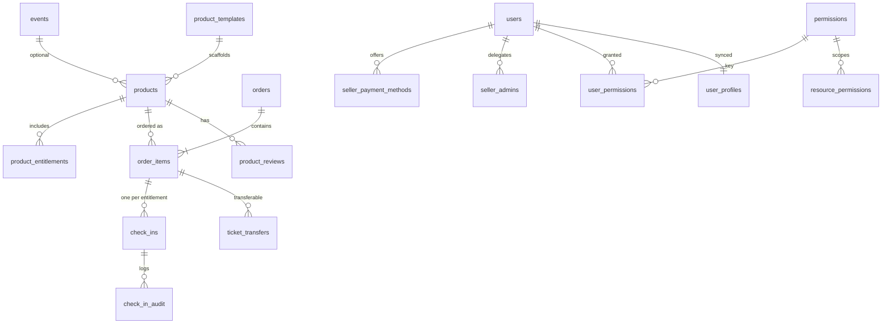

<div align="center">

<br>

```
██╗     ██╗██████╗ ██████╗  █████╗
██║     ██║██╔══██╗██╔══██╗██╔══██╗
██║     ██║██████╔╝██████╔╝███████║
██║     ██║██╔══██╗██╔══██╗██╔══██║
███████╗██║██████╔╝██║  ██║██║  ██║
╚══════╝╚═╝╚═════╝ ╚═╝  ╚═╝╚═╝  ╚═╝
```

```
sellers ═══════════════╤═══════════════ buyers
                       ▲
                 one storefront
```

**A multi-seller commerce platform for communities.**
Tickets · merch · digital goods · services — six Next.js apps, one Supabase database, one container.

<br>

[](https://nextjs.org/)
[](https://react.dev/)
[](https://www.typescriptlang.org/)
[](https://tailwindcss.com/)
[](https://supabase.com/)
[](https://pnpm.io/)
[](https://turborepo.dev/)

[](https://vitest.dev/)
[](https://playwright.dev/)
[](https://docker.com/)
[](LICENSE)
[](package.json)

<br>

</div>

---

## `00` — Status

> [!WARNING]
> **Production is offline.** It last served traffic on **2026-08-07**. The GCP free
> trial ended, Google suspended the project, the VM stopped, and the `cloudflared`
> process holding the production tunnel died with it. Every production hostname has
> returned Cloudflare `530 / 1033` since.
>
> The three deploy workflows were deleted on 2026-08-09 — each pointed at a host that
> no longer exists, and `deploy-gcp.yml` fired on every push to `main`, which would
> have turned every release into a failing run. They remain in git history.
>
> **Everything else works.** Dev, staging, E2E, CI and the Supabase projects are all
> live. Only the public deploy path is gone.
>
> → [`docs/production-status.md`](docs/production-status.md) — why it went down, which
> domain is which, and the single credential still missing to restore it.
> → [`docs/infrastructure.md`](docs/infrastructure.md) — how the environment was built,
> kept as a blueprint.

---

## `01` — What Libra is

Libra is a **multi-seller marketplace**, built as a pnpm workspace monorepo of six
Next.js 16 applications sharing one Supabase Postgres database.

It covers the full commerce loop: a seller lists a product, a buyer discovers it,
carts it, checks out across multiple sellers at once, picks a payment method the
seller defined, uploads proof of payment, and the seller approves or rejects the
order — with an operator watching over the whole thing through a permission system
granular enough to hand out a single capability.

**Why it exists.** Most storefronts assume one merchant, or they assume Stripe. Libra
assumes neither. It is built for community commerce — conventions, events, clubs,
collectives — where a dozen independent sellers share one storefront, each with their
own bank accounts and payment apps, and where "payment" often means a screenshot of a
bank transfer rather than a card charge. Stock integrity, evidence handling and
per-seller isolation are therefore enforced in the database, not in the UI.

**Some things worth knowing up front:**

- **Bilingual to the schema.** Every user-facing entity carries `name_en` / `name_es`;
  every app ships `en` + `es` message catalogs via `next-intl`.
- **52 currencies** as a Postgres enum — one price, one currency, no dual-column drift.
- **Authorization lives in the database.** Row-Level Security policies call a
  `has_permission()` SQL function. The frontend cannot grant itself anything.
- **Topology is configuration.** `APPS_MODE` and `SUPABASE_MODE` in an env file decide
  whether apps run as dev servers or a container, and whether Supabase is local, in
  Docker, or in the cloud. No script hardcodes a port, URL, image name or credential.

---

## `02` — The six apps

| App          |  Port   | Route       | Audience  | Owns                                                     |
| ------------ | :-----: | ----------- | --------- | -------------------------------------------------------- |
| **auth**     | `:5000` | `/auth`     | everyone  | Login, signup, Google & Discord OAuth, account settings   |
| **store**    | `:5001` | `/store`    | buyers    | Catalog, search, filters, product detail, cart            |
| **admin**    | `:5002` | `/admin`    | operators | Users, permissions, templates, settings, audit, reports   |
| **landing**  | `:5004` | `/`         | public    | Marketing, legal pages                                    |
| **payments** | `:5005` | `/payments` | both      | Checkout, orders, payment methods, receipts, reports      |
| **studio**   | `:5006` | `/studio`   | sellers   | Products, orders, delegated seller admins                 |

`apps/store` is the **reference implementation** — when apps disagree on a pattern,
store wins.

In production all six run inside a **single container**, each in Next.js standalone
mode, supervised by `supervisord`, fronted by an in-container nginx on `:8080` that
routes by path prefix.

---

## `03` — Architecture



Every app is redirected to the **auth host** (`apps/auth`) for login — protected apps
never own login UX, they only enforce a session check and redirect with a `returnTo`.
See [`ADR-0135`](docs/adr/ADR-0135-auth-host-boundary.md).

### Clean Architecture, inside every app

Dependencies flow inward only — `Presentation → Application → Domain ← Infrastructure`:

```
apps/<app>/src/
├── app/                        Next.js routing only — thin wrappers, no logic
├── features/<feature>/
│   ├── domain/                 types · constants · searchParams (nuqs parsers)
│   ├── application/            hooks · use cases · state
│   ├── infrastructure/         Supabase queries · storage · external calls
│   └── presentation/           components · pages
└── shared/                     cross-feature code for THIS app (incl. its i18n)
```

Features never import from each other. Cross-feature communication goes through
`shared/` or a workspace package. Enforced by ESLint (`eslint-plugin-boundaries`,
`no-restricted-imports`) and by `madge` for circular dependencies.

**Feature inventory:**

| App        | Features                                                              |
| ---------- | --------------------------------------------------------------------- |
| store      | `products` · `cart` · `auth`                                          |
| payments   | `checkout` · `orders` · `received-orders` · `assigned-orders` · `payment-methods` · `reports` · `auth` |
| studio     | `products` · `orders` · `seller-admins` · `auth`                      |
| admin      | `users` · `dashboard` · `reports` · `templates` · `settings` · `audit` · `auth` |
| auth       | `auth` · `account`                                                    |
| landing    | `home` · `legal`                                                      |

---

## `04` — Domain model

17 public tables, 38 migrations, RLS on everything user-facing.



**Product types** — `ticket` · `merch` · `digital` · `service`.
A product may hang off an `event`, or stand alone. Each carries
`product_entitlements` (what it includes: transport, entry, meal, merch, party) and
each entitlement produces its own QR-coded `check_in` row per purchased item.

**Order lifecycle** — the `payment_status` enum, in the order it usually travels:

```
pending → awaiting_payment → pending_verification → approved
                                    │                  ↑
                                    ├→ evidence_requested ┘   (seller asks for better proof)
                                    ├→ rejected
                                    └→ expired
```

Transitions run through SQL functions, not client writes: `update_order_status`,
`resubmit_evidence`, `reserve_stock`, `release_stock`.

**Payments are seller-defined.** There is no card processor. `payment_method_types` is
an operator-managed catalog (bank transfer, Nequi, Daviplata, …); each seller
configures their own `seller_payment_methods` from it, optionally requiring a receipt
upload or a transfer reference number. Buyers upload proof into the private `receipts`
storage bucket; sellers — or their delegates — verify it.

**Permissions** — 47 capability keys, each with `name_en`/`name_es`/description, stored
in `permissions`, granted per user via `user_permissions`, scoped via
`resource_permissions`. Families:

`products.*` · `orders.*` (incl. `approve`, `request_proof`) · `receipts.*` ·
`product_reviews.*` · `seller_payment_methods.*` · `seller_admins.*` ·
`payment_method_types.*` · `payment_settings.*` · `templates.*` · `events.*` ·
`check_ins.*` · `user_permissions.*` · `users.export` · `audit.read` · reports

RLS policies call `has_permission(key)` directly. Order and receipt delegation is
resolved by `is_order_delegate()` / `is_receipt_delegate()`, so a seller can hand a
teammate order-approval rights without handing over the account.

> **Checkout stock integrity is a hard rule.** Payment details are never returned by
> the backend when a cart exceeds stock — hiding them in the UI is explicitly not
> considered a control. See
> [`docs/standards/checkout-stock-integrity.md`](docs/standards/checkout-stock-integrity.md).

---

## `05` — Stack

<details>
<summary><strong>Runtime & tooling</strong></summary>

| Technology | Version   | Role                                    |
| ---------- | --------- | --------------------------------------- |
| Node.js    | 24        | Runtime (`.nvmrc`, CI matrix)           |
| pnpm       | 10.32.1   | Workspace package manager               |
| Turborepo  | 2.9       | Task graph, caching, parallel execution |
| Next.js    | 16.2.4    | App Router, standalone output           |
| React      | 19.2      | UI runtime                              |
| TypeScript | 6.0       | Strict, across every workspace          |

</details>

<details>
<summary><strong>UI & styling</strong></summary>

| Technology                | Role                                                    |
| ------------------------- | ------------------------------------------------------- |
| Tailwind CSS v4           | CSS-first config in `globals.css` — no `tailwind.config` |
| shadcn/ui + Radix         | Component primitives in `packages/ui`                    |
| `class-variance-authority` | Component variants                                      |
| `clsx` + `tailwind-merge` | The `cn()` helper                                        |
| `lucide-react`            | Icons                                                    |
| `tw-animate-css`          | Animation utilities                                      |
| `@hello-pangea/dnd`       | Drag & drop (studio, payments)                           |

Colors are OKLCH semantic tokens only — `text-destructive`, never `text-red-500`.
`globals.css` is kept byte-identical across apps and verified by
`scripts/check-css-sync.mjs`.

</details>

<details>
<summary><strong>Data, state & forms</strong></summary>

| Technology         | Role                                                    |
| ------------------ | ------------------------------------------------------- |
| Supabase JS + SSR  | Browser, server and proxy clients in `packages/api`      |
| TanStack Query     | Server state — caching, invalidation, background refresh |
| TanStack Table     | Data grids (store, studio, admin)                        |
| nuqs               | URL state — filters, pagination, tabs, view modes        |
| React Hook Form    | Forms (auth, studio)                                     |
| Zod                | Schema validation                                        |
| Axios              | HTTP mutator for generated clients                       |
| `exceljs`          | Admin report exports                                     |
| `react-markdown`   | Rendered policy/instruction text in payments             |

</details>

<details>
<summary><strong>Auth & i18n</strong></summary>

| Technology             | Role                                              |
| ---------------------- | ------------------------------------------------- |
| Supabase Auth (GoTrue) | Sessions, JWT, cookie handling                     |
| Google OAuth           | Social login                                       |
| Discord OAuth          | Social login                                       |
| PostgreSQL RLS         | The actual authorization boundary                  |
| `next-intl`            | `en` + `es` per app, via `shared/i18n` factories   |
| `cookies-next`         | Cookie access — raw `document.cookie` is lint-banned |

</details>

<details>
<summary><strong>Testing & observability</strong></summary>

| Technology            | Role                                        |
| --------------------- | ------------------------------------------- |
| Vitest 4              | Unit + component tests (**332 test files**) |
| Testing Library       | Component testing                           |
| MSW                   | API mocking (store, payments, admin)        |
| Playwright            | E2E (**24 spec files**)                     |
| `@faker-js/faker`     | Synthetic fixtures                          |
| `fast-check`          | Property-based testing                      |
| Sentry                | Error tracking in all six apps              |

</details>

<details>
<summary><strong>Quality tooling — 15 gates</strong></summary>

| Tool                | Catches                                                       |
| ------------------- | ------------------------------------------------------------- |
| ESLint (14 plugins) | security, jsx-a11y, unicorn, sonarjs, boundaries, tanstack-query, i18next, testing-library, better-tailwindcss, unused-imports, import, react-hooks, vitest |
| Prettier            | Formatting                                                     |
| Stylelint           | CSS + Tailwind conventions                                     |
| `check-css-sync`    | `globals.css` drift between apps                               |
| `check-env-parity`  | Missing keys across `.env.*` files                             |
| Secretlint          | Secrets in source and staged files                             |
| Semgrep             | SAST — OWASP Top Ten, CI, security-audit rulesets              |
| knip                | Unused files, exports, dependencies                            |
| madge               | Circular dependencies                                          |
| jscpd               | Copy-paste                                                     |
| cspell              | Typos in source                                                |
| ls-lint             | File and folder naming                                         |
| sherif              | Monorepo dependency mistakes                                   |
| syncpack            | Version mismatches across manifests                            |
| Husky + lint-staged | Runs the relevant subset on commit and push                    |

</details>

<details>
<summary><strong>Infrastructure</strong></summary>

| Technology        | Role                                                        |
| ----------------- | ----------------------------------------------------------- |
| Docker            | One image, all six apps, used for staging / E2E / prod       |
| nginx             | In-container reverse proxy on `:8080`, path-prefix routing   |
| supervisord       | Supervises the six standalone Next.js servers                |
| Kong              | Supabase API gateway in the self-hosted Docker stack         |
| Cloudflare Tunnel | Public URL without opening a port                            |
| GitHub Actions    | CI, releases, secret sync, scheduled production backup       |

</details>

---

## `06` — Getting started

**Prerequisites** — Node 24, pnpm 10 (`npm i -g pnpm`), Docker Desktop (staging & E2E
only), and the `gh` CLI authenticated if you want `pnpm sync-secrets`. The Supabase CLI
ships as a devDependency.

```bash
pnpm install
pnpm sync-secrets     # pulls .secrets from GitHub repository secrets
pnpm dev              # all 7 apps, .env.dev, Supabase Cloud dev project
```

| App        | URL                                |
| ---------- | ---------------------------------- |
| Landing    | `http://localhost:5004`            |
| Store      | `http://localhost:5001/store`      |
| Admin      | `http://localhost:5002/admin`      |
| Payments   | `http://localhost:5005/payments`   |
| Studio     | `http://localhost:5006/studio`     |
| Auth       | `http://localhost:5000/auth`       |

`pnpm dev` clears every `.next` cache first — stale caches and rotated env vars are a
classic source of phantom bugs here.

**One app at a time:**

```bash
pnpm --filter store dev        # or studio / admin / landing / payments
pnpm --filter auth-app dev     # note: the auth app's package name is auth-app
```

**Env debug viewer** — `http://localhost:5002/en/env`, enabled by `ENV_DEBUG=true`
(already on in `.env.dev`). It shows every resolved variable the apps actually see.

---

## `07` — Environments & topology

There are four env files, and they are the single source of truth for everything a
script needs. Two variables decide the entire shape of a run:

| Variable        | Values                    | Meaning                              |
| --------------- | ------------------------- | ------------------------------------ |
| `APPS_MODE`     | `local` \| `docker`       | dev servers, or the production image |
| `SUPABASE_MODE` | `cloud` \| `docker` \| `local` | where the database lives        |

| Env       | `APPS_MODE` | `SUPABASE_MODE` | `HOST_PORT` | `SUPABASE_PORT` | Notes                        |
| --------- | ----------- | --------------- | ----------- | --------------- | ---------------------------- |
| `dev`     | `local`     | `cloud`         | `5050`      | —               | dedicated Supabase Cloud project |
| `ci`      | `docker`    | `docker`        | `5050`      | `54321`         | used by `pnpm e2e:ci`        |
| `staging` | `docker`    | `docker`        | `7542`      | `64321`         | full self-hosted Supabase + tunnel |
| `prod`    | `docker`    | `cloud`         | `9090`      | —               | production Supabase project  |

`SUPABASE_PORT` is a **base port**; the whole stack derives from it — API at `base`,
Postgres at `base+1`, shadow DB at `base-1`, pooler `base+8`, Studio `base+2`,
Inbucket `base+3`, Analytics `base+6`. That is why staging (`64321`) and CI (`54321`)
can run simultaneously without colliding.

Dev ports are not hardcoded either — `scripts/start.mjs` discovers apps under `apps/`
and reads each port out of its `NEXT_PUBLIC_<APP>_URL`. Change the env file, change the
port.

**Running the container locally:**

```bash
pnpm docker:build --env staging              # build image
pnpm docker:build --env staging --up         # build + docker compose up
pnpm docker:build --env staging --up --tunnel # + Cloudflare tunnel
pnpm docker:build --env staging --no-cache   # force clean rebuild
pnpm docker:teardown --env staging           # stop container, remove image
```

**Self-hosted Supabase in Docker** (any env):

```bash
pnpm supabase:docker start   --env staging
pnpm supabase:docker status  --env staging
pnpm supabase:docker reset   --env staging   # migrations + seed
pnpm supabase:docker stop    --env staging
```

**Cloudflare tunnels** — declared per-env (`CLOUDFLARE_TUNNEL_APP_ENABLED`, `…_TOKEN`):

```bash
pnpm tunnel --env staging    # start every enabled tunnel
pnpm tunnel:stop
```

Full mechanics: [`docs/environment.md`](docs/environment.md).

---

## `08` — Secrets

Secrets never live in env files. Env files reference them:

```dotenv
NEXT_PUBLIC_SUPABASE_ANON_KEY=$secret:DEV_SUPABASE_ANON_KEY
```

`scripts/load-env.mjs` resolves `$secret:KEY` against `.secrets` (gitignored) at
runtime — and in CI, reads it straight from `process.env` instead. Existing env vars
always win, so CLI and CI overrides are never clobbered.

```bash
pnpm sync-secrets    # triggers sync-secrets.yml, downloads an encrypted artifact,
                     # decrypts it with a one-time passphrase, writes .secrets
pnpm lint:env        # every .env.* file must carry the identical key set — use N/A
```

Adding a secret: put it in GitHub repository secrets → add it to
`.github/workflows/sync-secrets.yml` → reference it as `$secret:NAME` → `pnpm sync-secrets`.
`.secrets.example` documents the full shape for manual setup.

---

## `09` — Database & code generation

```bash
pnpm supabase:start        # local Supabase instance
pnpm supabase:reset        # drop, re-apply all 38 migrations, seed
pnpm supabase:stop

pnpm codegen:supabase      # regenerate TS types from the local schema
pnpm codegen               # Orval: OpenAPI → React Query hooks
pnpm codegen:all           # both
```

> **Generated code is never edited by hand.** `packages/api/src/supabase/types.ts` and
> anything under a `generated/` directory is overwritten on the next run.

**A note on Orval.** [`orval.config.ts`](orval.config.ts) is fully wired — tags-split
output, React Query + Suspense hooks, Axios via the custom `customFetch` mutator — but
it is currently **dormant**: there is no `specs/openapi.yaml` in the repo, so
`packages/api/src/rest/generated` does not exist. Today the apps talk to Postgres
through the Supabase client with generated row types, wrapped in TanStack Query hooks
inside each feature's `infrastructure/` layer. The REST and GraphQL mutators are in
place for when a spec arrives.

**Operational scripts:**

```bash
pnpm user:grant-role --email <email> --role <buyer|seller|events|admin>
pnpm user:grant-admin                       # shorthand for the platform owner
pnpm provision:account --env prod           # seed an account + payment method
pnpm backup:prod                            # full DB + storage export → .ai-context/backups/
pnpm backup:prod --restore <dir>            # restore from an export
```

`backup-scheduled.yml` runs `backup:prod` daily at 04:00 UTC and only uploads when the
content actually changed.

---

## `10` — Testing

### Unit

```bash
pnpm test              # turbo test, every workspace
pnpm test:watch        # vitest watch
pnpm test:coverage     # with coverage
pnpm test:workflows    # the sync-secrets workflow's own tests
```

332 test files, co-located with their source. TDD is the expected loop: a test that
was never seen failing proves nothing.

### End-to-end

E2E is driven by [`scripts/e2e.mjs`](scripts/e2e.mjs), which reads the same
`APPS_MODE` / `SUPABASE_MODE` topology as everything else and brings up whatever the
chosen environment needs — dev servers or container, Docker Supabase, tunnel — then
runs Playwright and tears it all down.

```bash
pnpm e2e:dev                  # apps local, Supabase Cloud dev
pnpm e2e:dev:headed
pnpm e2e:ci                   # container + Docker Supabase on 54321
pnpm e2e:staging              # container + full Docker Supabase on 64321
pnpm e2e:staging:headed

node scripts/e2e.mjs --env dev --app store   # scope to one app
node scripts/e2e.mjs --help
```

> The first containerized run takes several minutes — image build plus database
> initialization. Later runs reuse the image and volume.

**What the 24 specs cover:**

| Area              | Specs                                                                   |
| ----------------- | ----------------------------------------------------------------------- |
| Session & OAuth   | `auth-session` · `google-login` · `discord-login` · `navbar-auth-state`  |
| Purchase          | `full-purchase-flow` · `checkout-stock-integrity` · `checkout-order-integrity` |
| Receipts          | `receipt-reference-flow` · `receipt-delegate-flow` · `admin-users-export-receipts` |
| Delegation & RBAC | `permission-management` · `delegated-admin-flow` · `delegated-reports` · `delegated-reports-rls` |
| Seller & reports  | `studio-product-ui` · `studio-ux-improvements` · `seller-reports` · `reports` |
| Store surface     | `navbar-persistence` · `product-detail-seller-card` · `theme-and-language` |
| Cross-cutting     | `smoke-all-apps` · `mobile-layout` · `audit-log` · `users`               |

**Selectors are test IDs first.** Components expose them through the `tid()` helper;
state is asserted through ARIA or `data-*` attributes. Asserting on Tailwind classes is
forbidden, and `toContainText()` / `toHaveText()` are ESLint errors — tests must not
break when a translation changes.

---

## `11` — Quality gates

```bash
pnpm format           # Prettier write
pnpm format:check     # Prettier check (CI mode)
pnpm lint             # ESLint across all 12 workspaces
pnpm typecheck        # turbo typecheck
pnpm lint:env         # env key parity
pnpm check:style      # Stylelint + cross-app globals.css sync
pnpm check:tools      # cspell + knip + jscpd + ls-lint + madge + sherif + syncpack
pnpm secretlint       # scan the whole tree
pnpm semgrep          # SAST
pnpm fix:all          # format + lint --fix
```

**Git hooks** (Husky) are scoped rather than exhaustive, so they stay fast:

- **pre-commit** — `lint-staged` on staged files only (Prettier, ESLint, Secretlint);
  plus `sherif` and `syncpack` when a manifest or the lockfile changed. ESLint blocks on
  **errors**, not warnings: `eslint.config.mjs` deliberately stages some rules as warnings
  so they can be driven to zero one at a time, and rejecting every warning in a touched
  file made those files uneditable — the only way through was `--no-verify`, which skips
  Secretlint too. See [Quality Gates](docs/standards/quality-gates.md).
- **pre-push** — detects changed workspaces via `scripts/detect-changes.sh`, runs unit
  tests only for those (everything, if `packages/` or tooling changed), and runs a
  Docker health check when deploy files changed. Docs-only pushes skip it entirely.

The aggregate scripts `pnpm precommit` and `pnpm prepush` run the full sweep by hand.

---

## `12` — CI/CD

```
Pull request  →  develop | main
│
├─ ci.yml
│   ├─ changes        which apps/packages changed — docs-only PRs short-circuit
│   ├─ quality        format:check · lint · typecheck · sherif · syncpack
│   ├─ unit-tests     test:coverage
│   ├─ build          pnpm build with NEXT_PUBLIC_* baked in
│   ├─ bundle         bundle analysis (PRs only)
│   ├─ docker-build   docker/ci/Dockerfile
│   └─ e2e-tests      Playwright against the built image
│
├─ pr-checks.yml      branch target · conventional PR title · pnpm audit
└─ pr-freshness.yml   flags PRs that have fallen behind their base

release/* merged → main
└─ release.yml        extracts vYYYY.MM.DD.N from the PR title, cuts a GitHub Release

Manual / scheduled
├─ sandbox-release.yml   promote a commit to staging (workflow_dispatch)
├─ sync-secrets.yml      encrypted secret bundle for pnpm sync-secrets
├─ backup-scheduled.yml  production backup, 04:00 UTC daily
└─ notify-bug-issue.yml  bug-labelled issues → Telegram
```

`ci.yml` triggers on **pull requests only**. There is no push-to-main pipeline — see
[`00 — Status`](#00--status).

### Production shape

One image (`docker/prod/Dockerfile`, `node:22-alpine`), layered so the stable pieces —
nginx config, supervisord config — sit *below* the volatile app layers and keep
their hashes between builds. Inside:

```
nginx :8080
  ├─ /            → landing    :5004
  ├─ /store       → store      :5001
  ├─ /admin       → admin      :5002
  ├─ /auth        → auth       :5000
  ├─ /payments    → payments   :5005
  ├─ /studio      → studio     :5006
  └─ /health      → container healthcheck
supervisord → 6 × Next.js standalone servers
```

Liveness is `docker compose`'s `healthcheck` (`GET /health`, `restart: unless-stopped`) —
no in-container watcher process.

The container runs hardened: `--cap-drop=ALL`, `--security-opt=no-new-privileges`,
`--pids-limit=1024`, `--restart unless-stopped`.

---

## `13` — Shared packages

| Package                     | Contains                                                                                    | Rule                                        |
| --------------------------- | ------------------------------------------------------------------------------------------- | ------------------------------------------- |
| **`packages/api`**          | Supabase browser/server/proxy clients, cookie + callback helpers, generated row types, REST & GraphQL mutators, token utilities | Generated files are never hand-edited       |
| **`packages/auth`**         | Auth domain contracts, client hooks, server guards, permission model                        | The auth-host boundary lives here           |
| **`packages/ui`**           | shadcn/ui + Radix primitives, `cn()`, shared stylesheet                                     | **No i18n, no business logic, no app config** |
| **`packages/shared`**       | Pure utils, hooks, constants, providers, and the `createAppI18n` / `createAppRouting` factories | Must stay side-effect free                  |
| **`@monorepo/app-components`** | Cross-app components that genuinely need `next-intl` context                              | The escape hatch `packages/ui` refuses      |

**The props-injection rule.** `packages/ui` has no translations. Apps pass translated
strings down as props (`closeLabel={t("close")}`). That keeps primitives testable
without an i18n provider and lets each app own its own locales.

Packages are consumed **as source**, not as builds — `main` points at `src/index.ts`
and apps list them in `transpilePackages`. Tree-shaking, hot reload and no build step,
at the cost of requiring compatible TS configs everywhere.

Before adding anything to a package, it must be used by 2+ apps, need no i18n, need no
app config, and be pure. Otherwise it belongs in that app's `shared/`.

---

## `14` — Conventions

| Convention                | Rule                                                                                 |
| ------------------------- | ------------------------------------------------------------------------------------ |
| Store is the standard     | `apps/store` is the reference; other apps comply with it                             |
| One component per file    | Enforced by `react/no-multi-comp`; shadcn `ui/` and test files are the only exceptions |
| Absolute imports          | `@/features/…` across layers, never `../../`; same-directory `./x` is fine           |
| URL state                 | Filters, pagination, tabs, sort → `nuqs` parsers in `domain/searchParams.ts`. Ephemeral UI → `useState` |
| Semantic colors only      | `text-destructive`, never `text-red-500`; OKLCH tokens in `globals.css`               |
| No hardcoding             | Magic numbers → `domain/constants.ts` · magic strings → enum-like objects · inline types → `domain/types` · fixtures → `src/mocks/data` |
| Libraries over hand-rolls | If a battle-tested package exists, use it — suppressing a lint rule to hand-roll is not an option |
| Tailwind stays inline     | Repeated utility strings are **not** a DRY violation. If it repeats, make a component, not a constant |
| KISS beats DRY            | When they conflict, favour the simpler code and let the duplication stand            |
| Commit policy             | Never auto-commit. An explicit instruction is required, every time                    |

The full rule set — 31 rules and 38 skills — lives in [`.claude/`](.claude/) and is
written to be portable to another project unchanged. [`CLAUDE.md`](CLAUDE.md) is the
index.

---

## `15` — Git workflow

```
main     ══════════════════════════════  production · protected
            ▲  release/*   (scheduled releases)
            ▲  fix/*       (critical hotfixes only)
develop  ══════════════════════════════  integration · protected
            ▲  feat/*  chore/*  refactor/*  docs/*  fix/*

branch    type/GH-{issue}_{Short-Title}      feat/GH-42_User-Authentication
commit    type(scope): description [GH-XXX]  feat(auth): add login validation [GH-42]
release   vYYYY.MM.DD.N                      v2026.04.22.1
```

`release/*` always targets `main`. `fix/*` may target either — hotfixes branch from
`main`, ordinary bug fixes from `develop`. **Everything else targets `develop`**, and a
GitHub Action enforces it. Release PR titles must read `chore(release): vX` — `release:`
alone is not a valid conventional-commit type and the title check will reject it.

`develop` merges are squashed; `main` merges keep the merge commit.

---

## `16` — Command index

<details>
<summary><strong>Every root script</strong></summary>

| Command                       | Does                                                       |
| ----------------------------- | ---------------------------------------------------------- |
| `pnpm dev`                    | All apps, `.env.dev`                                       |
| `pnpm dev:test`               | All apps, `.env.test`                                      |
| `pnpm build`                  | Turbo build, `.env.prod` (`--env <name>` to change)        |
| `pnpm lint` / `format` / `typecheck` | The usual three                                     |
| `pnpm lint:env`               | Env key parity across `.env.*`                             |
| `pnpm check:style`            | Stylelint + CSS sync                                       |
| `pnpm check:tools`            | cspell · knip · jscpd · ls-lint · madge · sherif · syncpack |
| `pnpm secretlint` / `semgrep` | Secret scan / SAST                                         |
| `pnpm test` / `:watch` / `:coverage` | Unit tests                                          |
| `pnpm test:workflows`         | Workflow script tests                                      |
| `pnpm e2e:dev` / `:staging` / `:ci` | E2E, `+:headed` variants                             |
| `pnpm docker:build`           | Build the image (`--up`, `--tunnel`, `--no-cache`)         |
| `pnpm docker:teardown`        | Remove container + image                                   |
| `pnpm supabase:start/stop/reset` | Local Supabase CLI instance                             |
| `pnpm supabase:docker <cmd>`  | Isolated Docker Supabase stack per env                     |
| `pnpm codegen` / `:supabase` / `:all` | Orval / Supabase types / both                      |
| `pnpm tunnel` / `tunnel:stop` / `tunnel:switch` | Cloudflare tunnels                       |
| `pnpm sync-secrets`           | Pull `.secrets` from GitHub                                |
| `pnpm user:grant-role` / `user:grant-admin` | Grant permission bundles                     |
| `pnpm provision:account`      | Seed an account + payment method                           |
| `pnpm backup:prod`            | Full production backup / restore                           |
| `pnpm precommit` / `prepush`  | Full local gate sweeps                                     |
| `pnpm clean:builds` / `clean` | Drop build artifacts / everything incl. `node_modules`     |

</details>

---

## `17` — Documentation map

| Document                                                                              | Read it when                                    |
| ------------------------------------------------------------------------------------- | ----------------------------------------------- |
| [`CLAUDE.md`](CLAUDE.md)                                                               | You want the conventions index                  |
| [`docs/environment.md`](docs/environment.md)                                           | Anything touching env files, ports, Docker, tunnels |
| [`docs/production-status.md`](docs/production-status.md)                               | You want production back online                 |
| [`docs/infrastructure.md`](docs/infrastructure.md)                                     | You are rebuilding the deploy environment       |
| [`docs/production-incident-playbook.md`](docs/production-incident-playbook.md)         | Production is down and you need steps           |
| [`docs/standards/checkout-stock-integrity.md`](docs/standards/checkout-stock-integrity.md) | You are touching cart, checkout or payment methods |
| [`docs/adr/`](docs/adr/)                                                               | You want to know why a boundary exists          |
| [`docs/hooks-ci-release/`](docs/hooks-ci-release/)                                     | You want the hooks → CI → release flow diagrams |
| [`.claude/rules/`](.claude/rules/)                                                     | You want the enforceable version of a convention |

---

<div align="center">

<br>

```
   7 apps  ·  5 packages  ·  17 tables  ·  38 migrations  ·  356 test files
   ────────────────────────────────────────────────────────────────────────
   Next.js 16   React 19   TypeScript 6   Supabase   Tailwind v4   Docker
```

<sub>MIT licensed · <a href="docs/environment.md">Environment</a> · <a href="CLAUDE.md">Conventions</a> · <a href="docs/production-status.md">Production status</a></sub>

<br>

</div>
